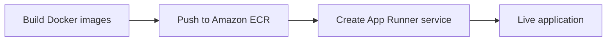
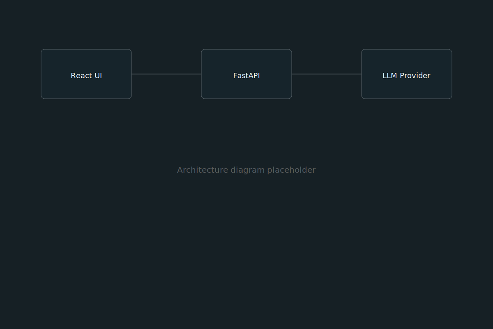

# Deployment Guide (Placeholder)

> This is placeholder guide content used to demonstrate the guide modal. Replace it with your real deployment documentation.

This guide walks through deploying the containerized LLM chat application to AWS App Runner using images stored in Amazon ECR.

## Prerequisites

- An AWS account with permissions for ECR and App Runner
- Docker installed locally
- The application images built and tagged

## Deployment flow



## Steps

1. Authenticate the Docker CLI to your Amazon ECR registry.
2. Build and tag the frontend and backend images.
3. Push both images to ECR.
4. Create an App Runner service for each image.
5. Configure environment variables and health checks.

## Architecture reference



## Example command

```bash
aws ecr get-login-password --region us-east-1 \
  | docker login --username AWS --password-stdin <account>.dkr.ecr.us-east-1.amazonaws.com
```

## Demo

<video controls poster="../images/demo-poster.svg" src="../videos/deploy-demo.mp4"></video>

## Notes

| Setting | Value |
| --- | --- |
| Region | us-east-1 (placeholder) |
| CPU | 1 vCPU (placeholder) |
| Memory | 2 GB (placeholder) |

Replace all placeholder values with your actual configuration.
